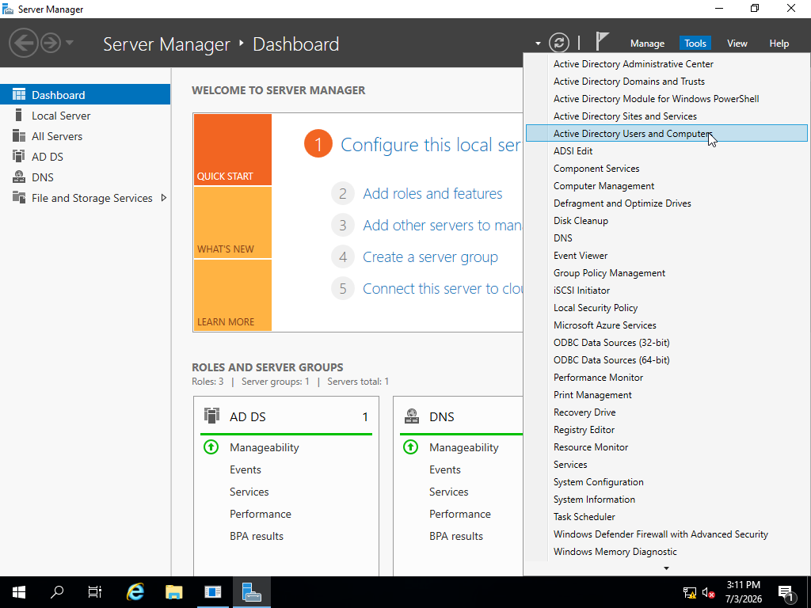
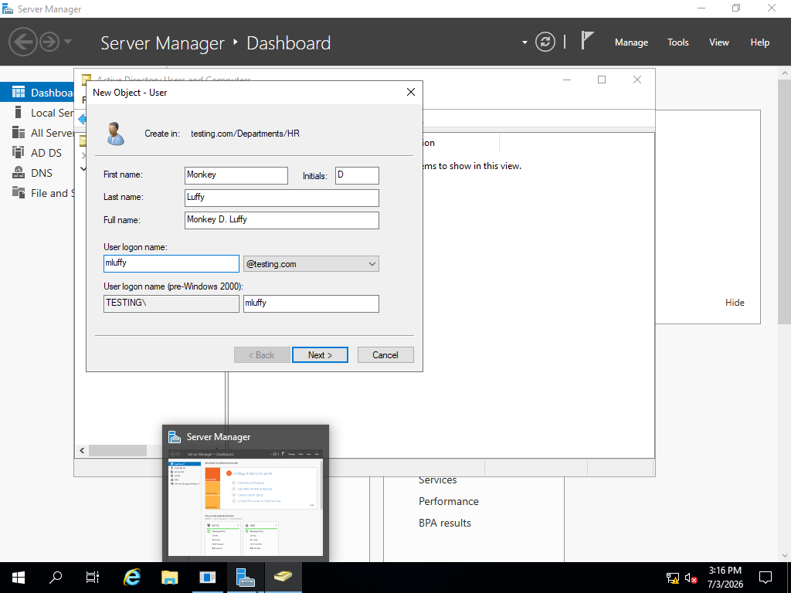
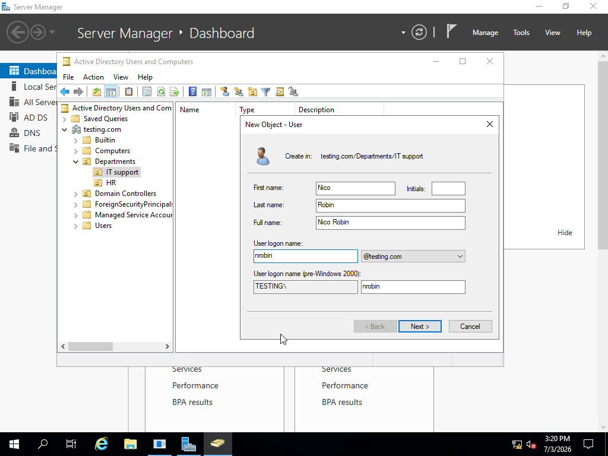
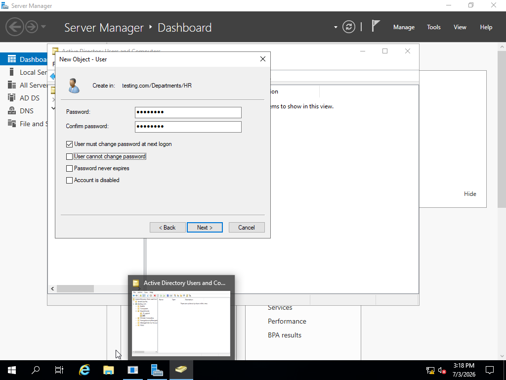

# Create Active Directory Users

## Objective

Create new user accounts within Active Directory.

## Actions Performed

- Opened Active Directory Users and Computers.
- Navigated to the Users Organizational Unit.
- Created new user accounts.
- Assigned usernames and passwords.
- Verified successful account creation.

## Process:

Opened the Server Manager and navigated to **Active Directory and Tools**

Selected the correct domain and looked for the *Organization Unit* I wanted the new user in.
After you select the new users correct *Organization Unit*, you right-click the Folder and select **User**. 

Now you are able to add the **First** and **Last name** for the users and their respected **Username**

After the names for the user is done,click next and you are able to put a password for the employee. *A good rule of thumb is to leave the box "User must change password on next login"*

