# Active Directory - Joining a Windows 11 Enterprise Workstation to a Domain

## Project Overview

In this lab, I configured a Windows 11 Enterprise virtual machine as a domain-joined workstation connected to a Windows Server Active Directory environment.

The purpose of this project was to simulate the process IT professionals perform when deploying new computers into an enterprise environment. This included configuring network communication, pointing the workstation to the Domain Controller for DNS resolution, joining the domain, and verifying successful authentication.

---

# Lab Environment

## Virtual Machines

| Machine | Operating System | Role |
|---|---|---|
| TESTLAB | Windows Server | Domain Controller / Active Directory / DNS |
| WIN11-CLIENT | Windows 11 Enterprise | Domain-Joined Workstation |

## Technologies Used

- Active Directory Domain Services (AD DS)
- DNS
- Windows Server
- Windows 11 Enterprise
- VirtualBox Host-Only Networking

---

# Objective

The goal of this project was to:

- Configure communication between a Windows 11 client and Domain Controller
- Configure DNS settings required for Active Directory
- Join a workstation to an Active Directory domain
- Authenticate using a domain administrator account
- Verify successful domain membership

---

# Network Configuration

The Windows 11 workstation was configured to communicate with the Domain Controller using a Host-Only network in VirtualBox.

# Process: #

First after you installed the iso for the Windows 11 Enterprise,click the windows button and type *Control Panel*.

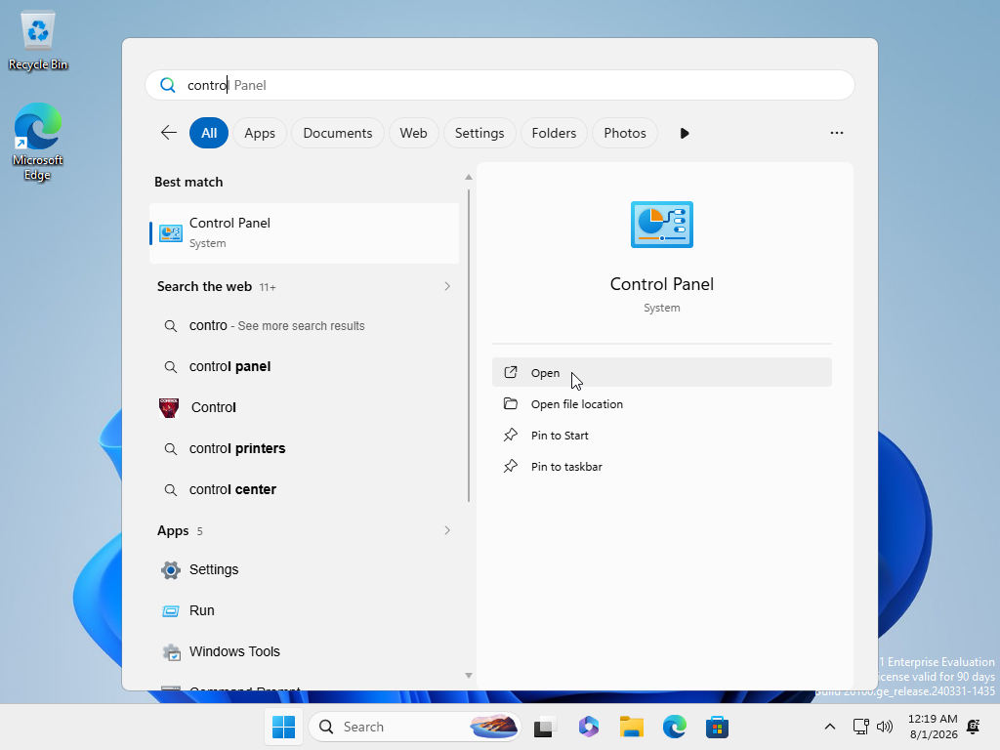

Now after you open the program,click on `Network and Internet`.
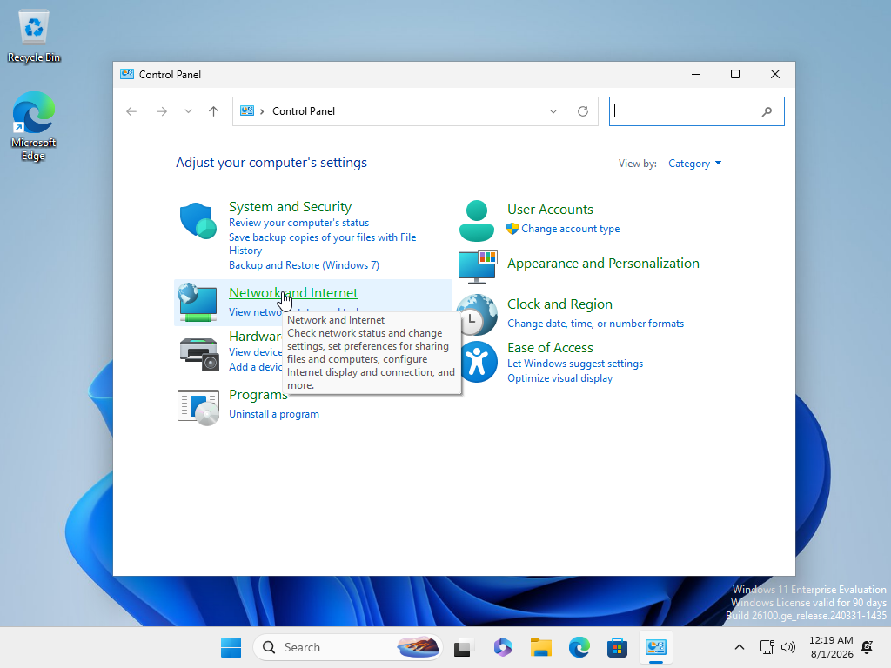

Click on `Network & Sharing Center`.
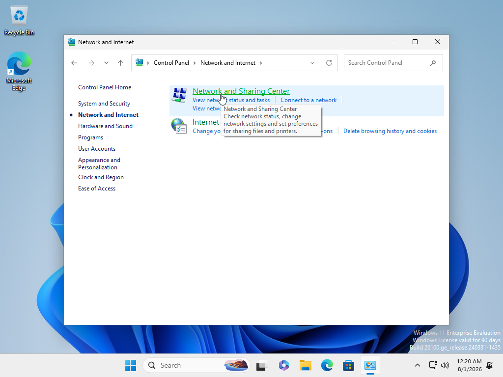

Click on `Ethernet`.
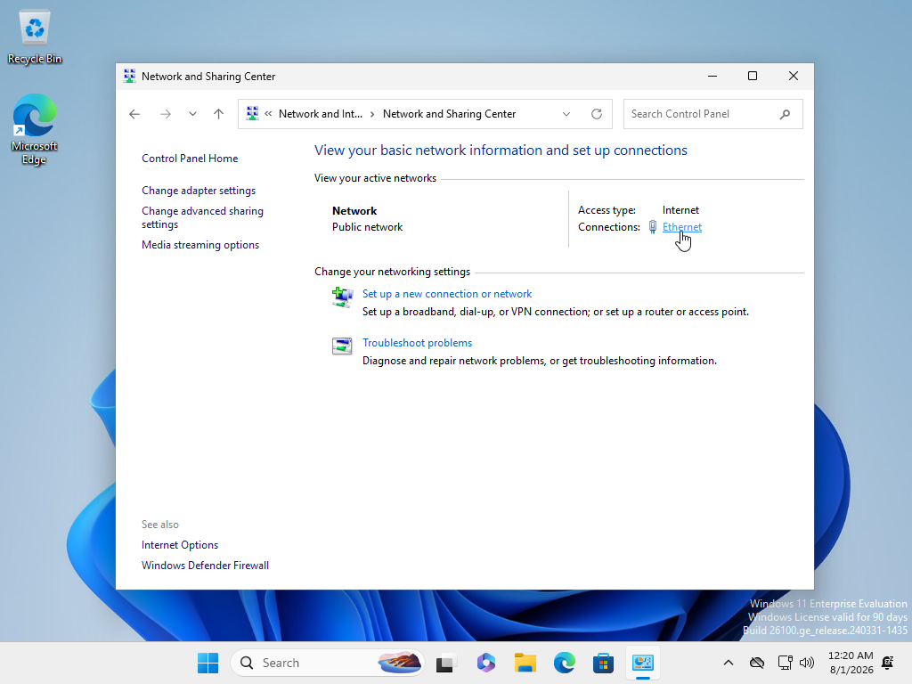

A box will appear, click on `Ethernet Properties`.
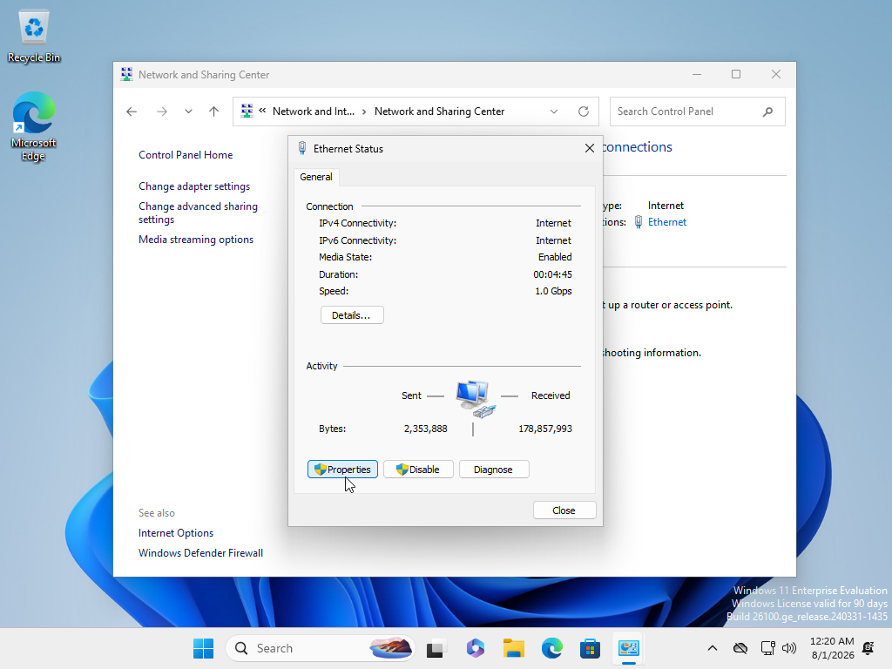

Now another box shows, click on the `Internet Protocol Version 4 (TCP/IPv4)`.
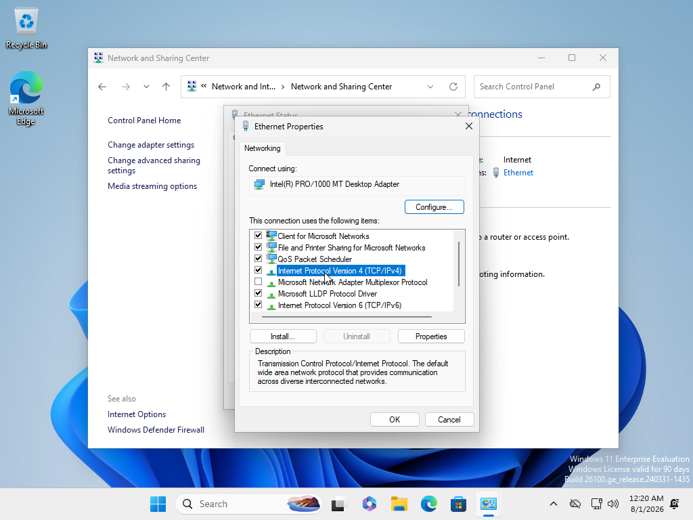

Now click *Use the following IP address*, for me this IP Address was from my Server VM IP so i can have a connection to the server.

So I would put the servers VM IP as well as the DNS for the server.

Click `Done`.

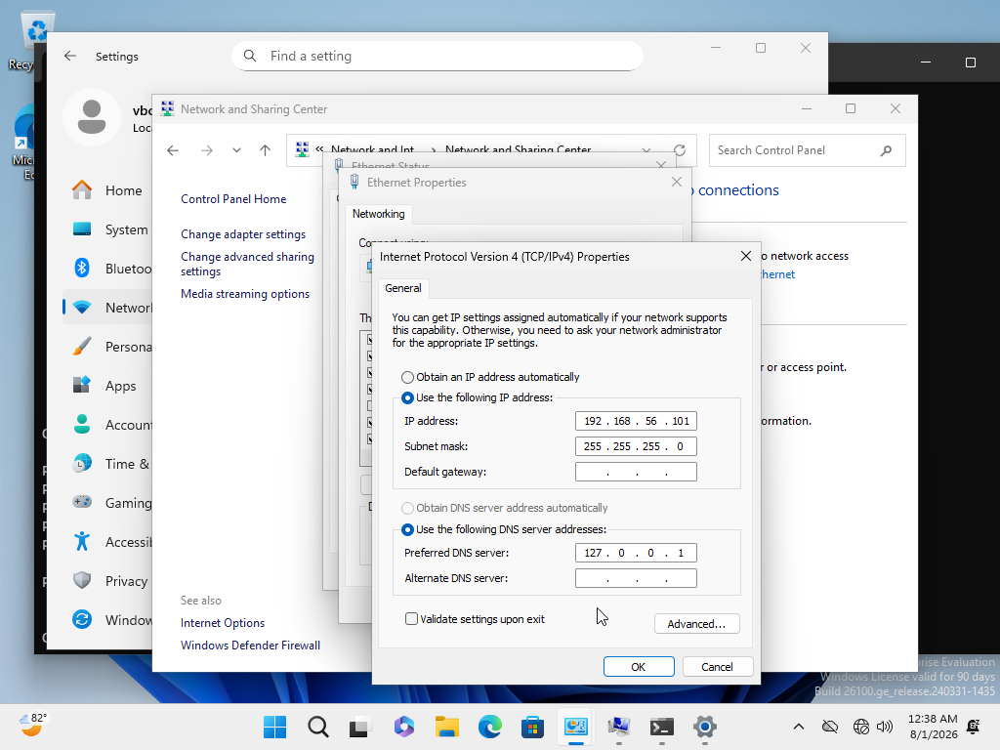

Now click the Windows logo and Type `About My PC`.
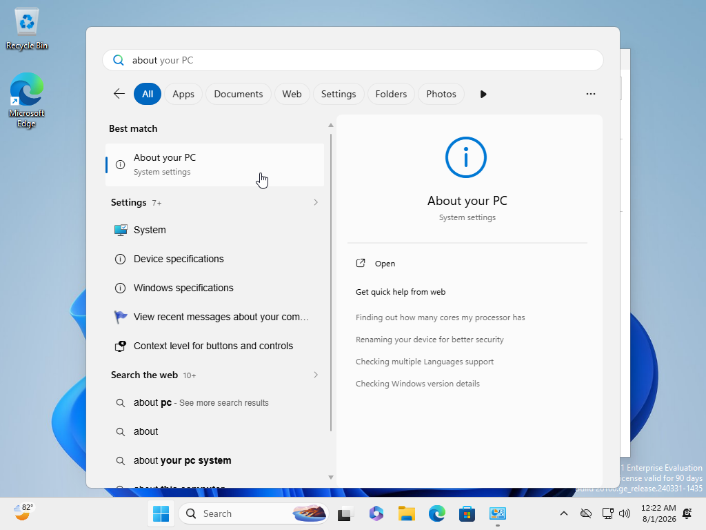

Stroll down and click `Domain or workgroup`
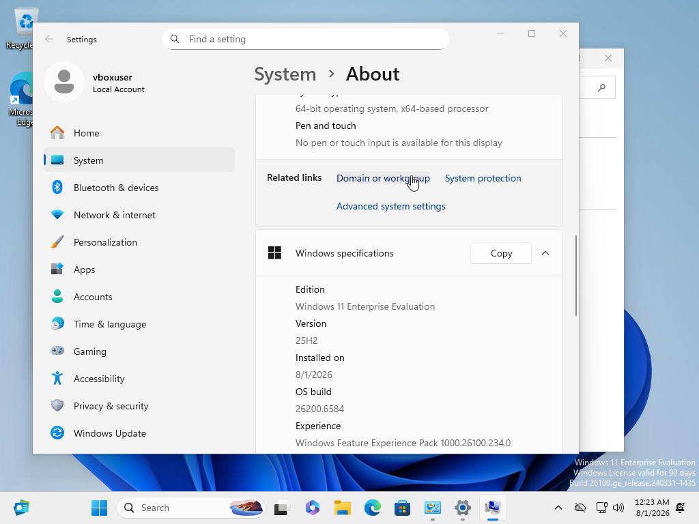

Now click `Change` You can also change the computers name from here as well.
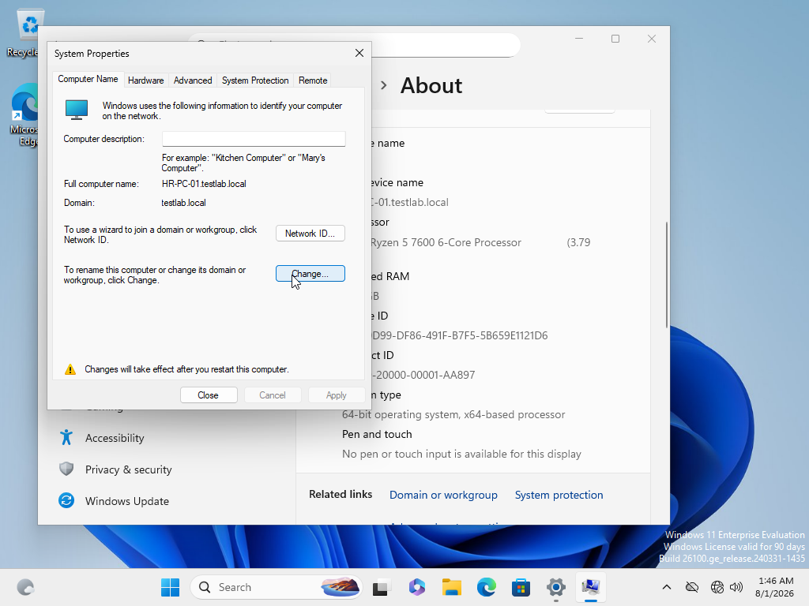

Now in the box, put the domain's name and click `Ok`.
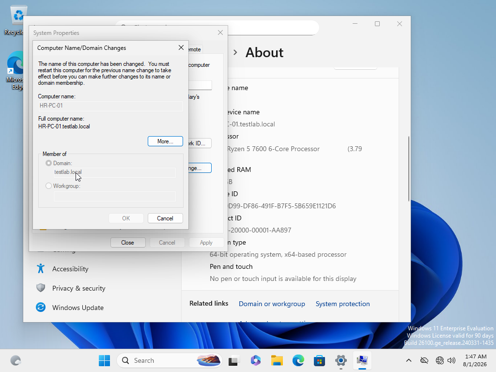

