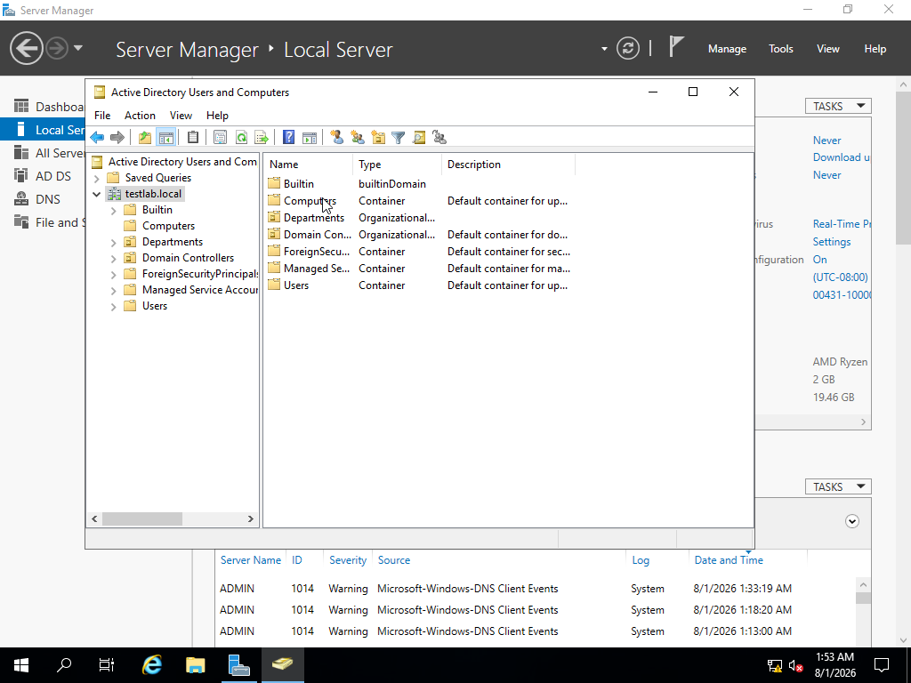
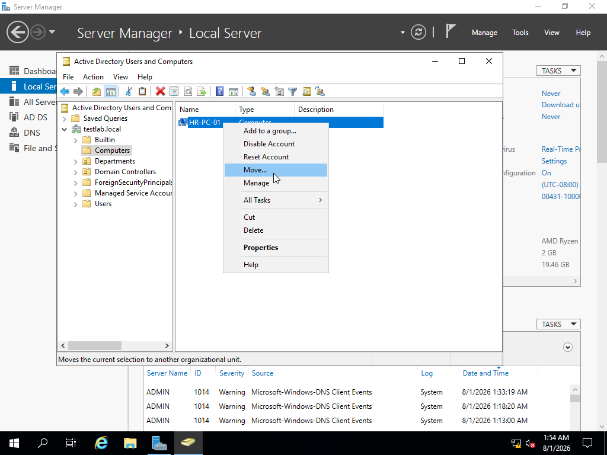
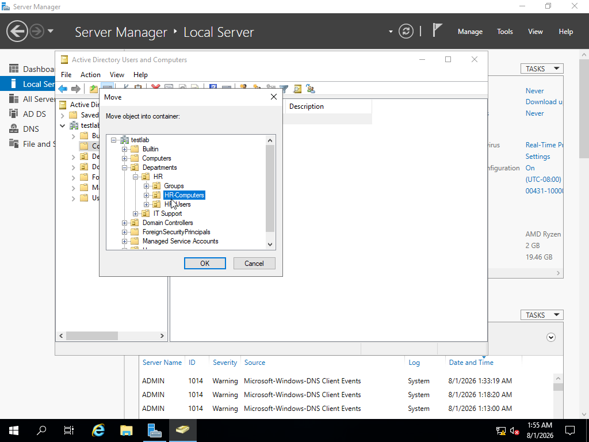

# Active Directory - Moving Computers to the Correct Organizational Unit (OU)

## Project Overview

In this lab, I practiced managing computer objects within Active Directory by moving domain-joined computers from the default Computers container into the appropriate Organizational Unit (OU).

In a real enterprise environment, organizing computer accounts into the correct OUs allows administrators to apply specific Group Policies, security settings, and permissions based on department requirements.

---

# Objective

The goal of this task was to:

- Identify newly joined domain computers
- Locate computer objects inside Active Directory Users and Computers
- Create and organize department-based Organizational Units
- Move computer accounts into the correct OU
- Verify that the computer object was placed correctly

#Process:

Go to the domain and look for `Computer` OU
We need to find the computer we just joined from our other VM

Found the **PC**, right-clicked on the computer and left-clicked `Move`

Now you are able to move the computer to the **Organizational Unit**, mines will be the folder called `HR-Computers`

