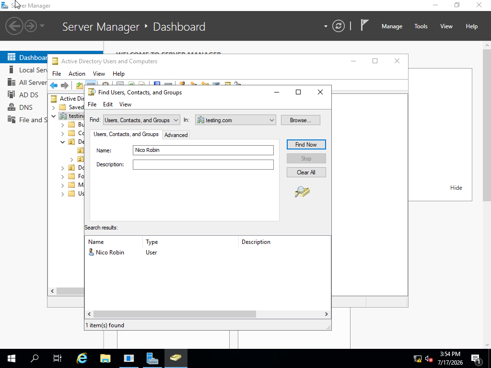
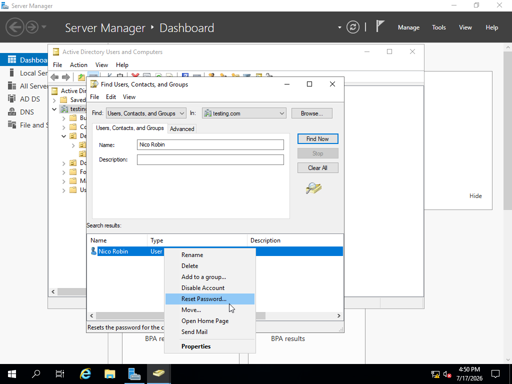
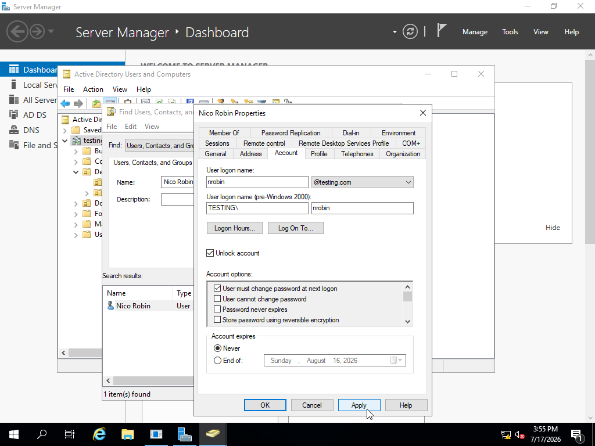
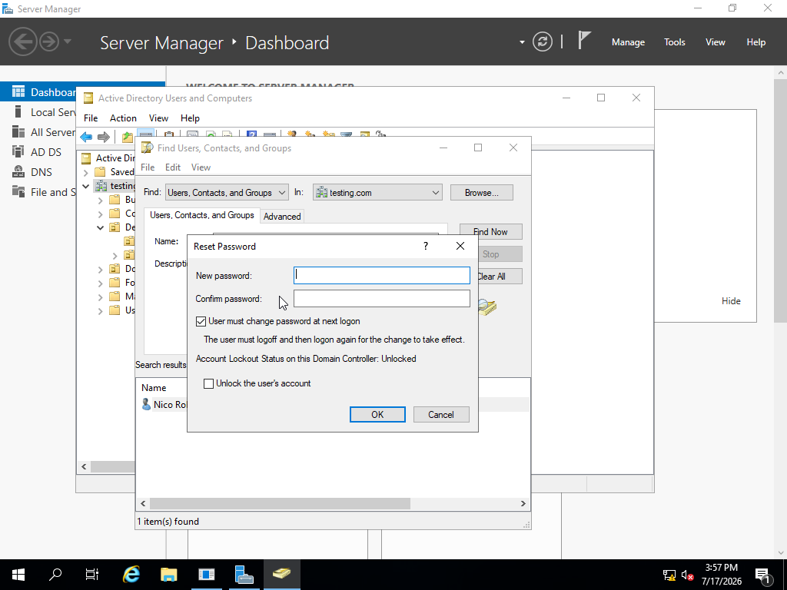
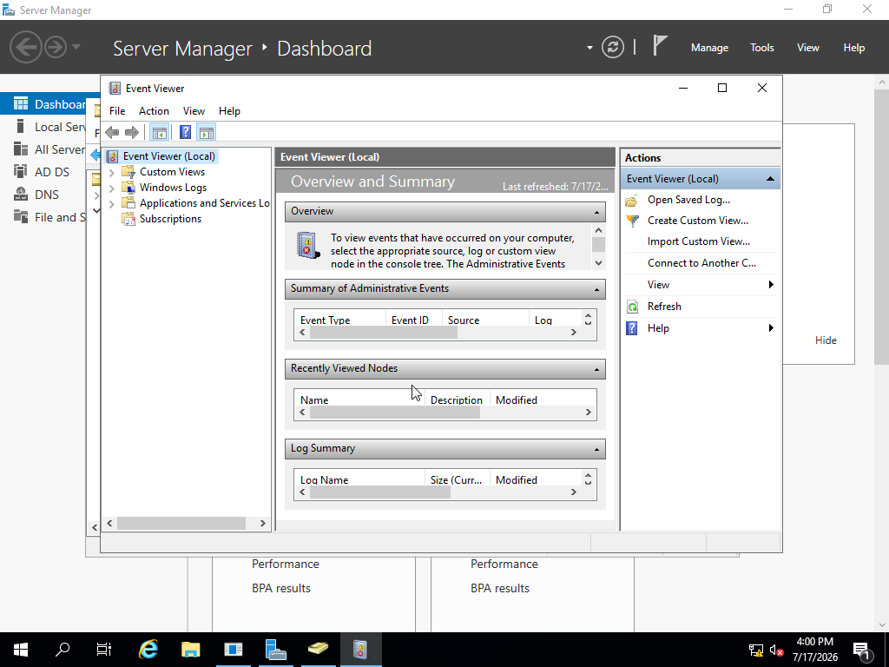
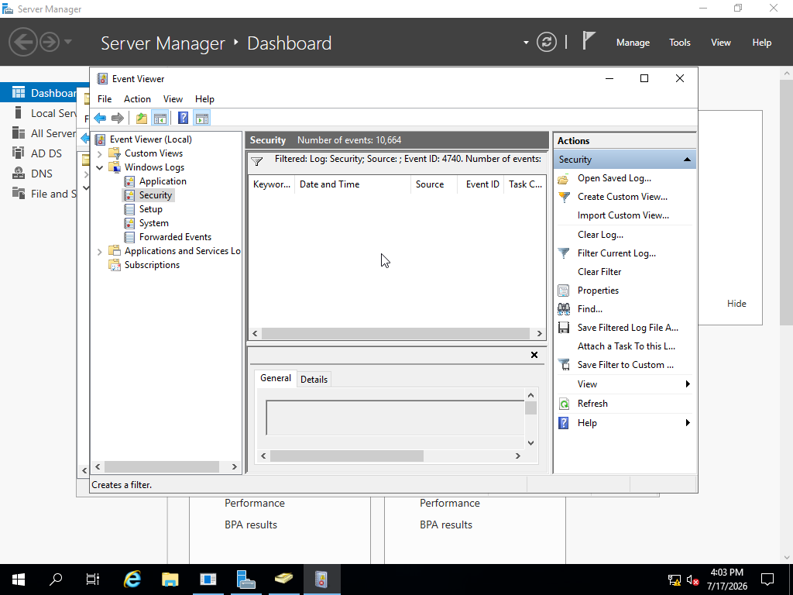

## Active Directory Password Reset & User Account Management Lab

## 📌Overview

This project demonstrates the process of resetting a user's password and troubleshooting account access issues in a Windows Server Active Directory environment. The goal was to simulate a real-world Help Desk ticket and document the resolution process.

### 🖥️Lab Environment

Operating System:

Windows Server 2022 (Domain Controller)

Windows 7 Client

### Tools Used:

Active Directory Users and Computers (ADUC)

Windows Server Manager

PowerShell

### Skills Practiced:

Active Directory user management
Password resets
Account unlocking
User troubleshooting
IT documentation

# 📝Scenario
Help Desk Ticket
### Ticket #001

### User: Nico Robin

### Department: IT support

## Issue: User unable to log in due to forgotten password

Reported Problem: User contacted the Help Desk stating they could not access their workstation.

Goal: Reset the user's password and restore account access.

# Process:

Opened Server Manager and navigated to Tools.

Selected Active Directory Users and Computers to access the domain directory.

Right-clicked on the domain/forest and selected Find.

Entered the user's name to search for the account within Active Directory.

Verified the correct user account was located before performing administrative actions.

Once I've confirmed the users identity, I right-click on their name at the bottom. Then I would click *Reset Password*

Now if the user knows their password then I would simply click on *Unlock Account*

If the user forgots the password fully then I would click on the *Reset Password* option and give them a temp password and unlock their account

Now if the problem still presists and its locking them out after they changed their passwords then I would open Event Viewer to look for the computer that may be causing the issue due to the fact that some computers take a while to refresh the cache and therefore is holding the old password still.

After I open that program, I would click on the folder that says *Window's Logs* to show me the log information. Then I would click on the *Security* subfolder and that would show me the security section of the logins i.e passwords

Now I would click on the funnel option to the right and under *Event ID* I would type 4740 which is the set of numbers that would tell me if theirs any lockouts of any account

