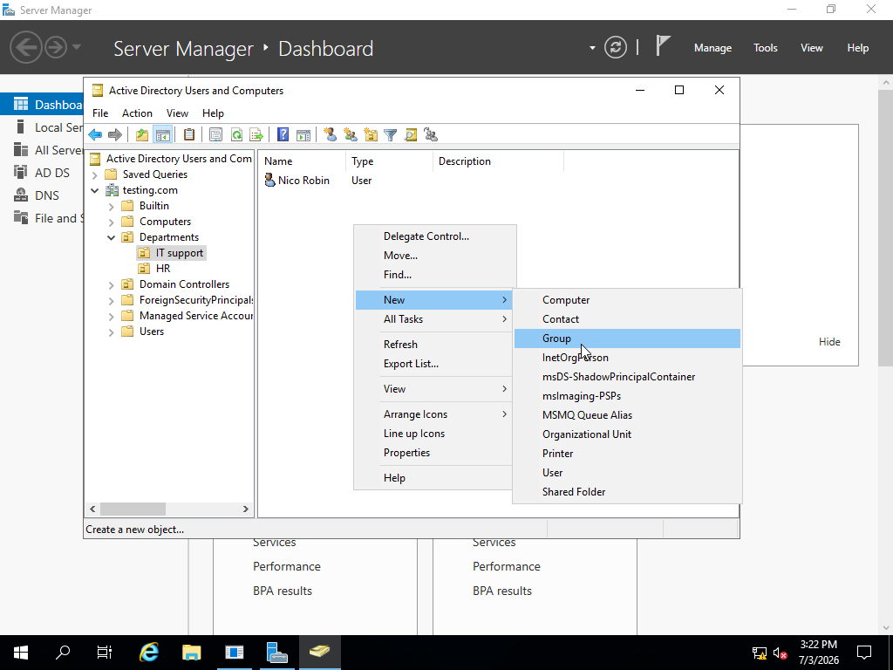
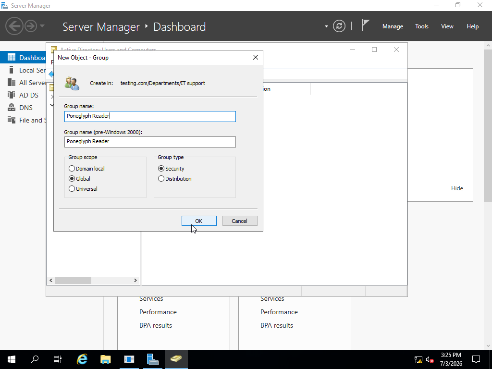
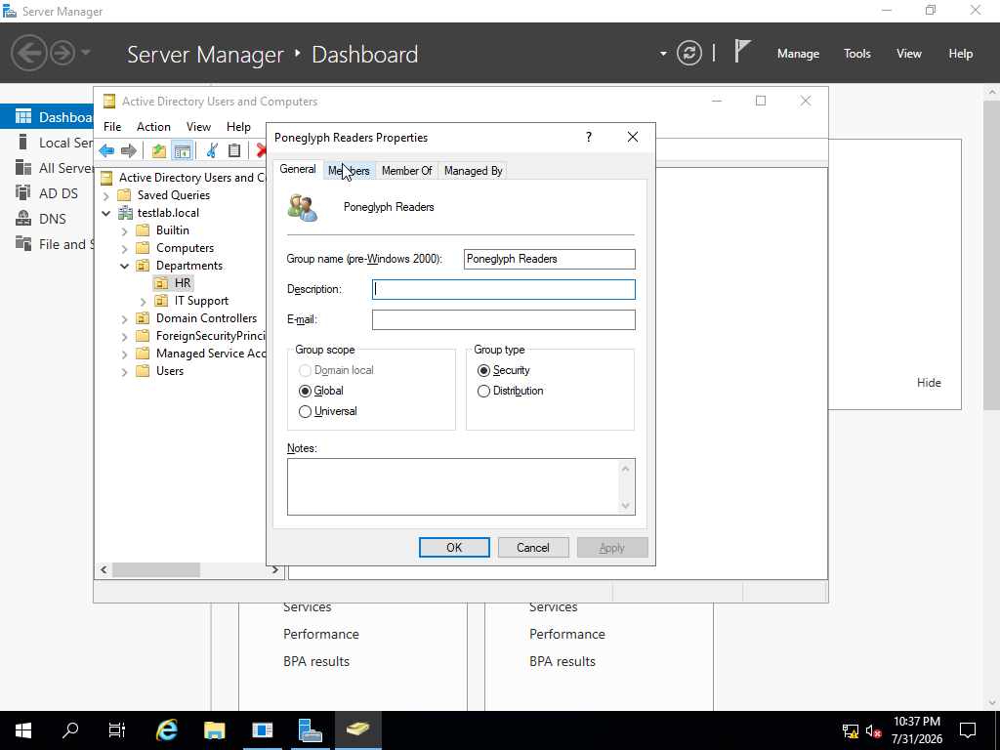

# Create Security Groups

## Objective

Create security groups to simplify permission management.

## Actions Performed

- Opened Active Directory Users and Computers.
- Created new Global Security Groups.
- Assigned descriptive names.
- Verified successful creation.

## Process:

Go into the **Organizational Unit** you want the certain security permission assigned to. For me it was the IT Department.
In the empty spot, right click and select `New`, then `Group`

Now you would put the correct name for the group ie: Managers, Interns, HelpDesk.  

Now the Group Scope can be set as requested. 

`Domain Local`:Its gives the group or users that are assigned to it certain permissions.

`Global`:Gives the users within this group a name to organize them within that domain.We well be using Global for this example.

`Universal`:Combines users/groups across different domains.

Now you can double click the `Group` you just made to pull up this menu.

Now click on `Members`, this is where you can add the members you want in said group.

